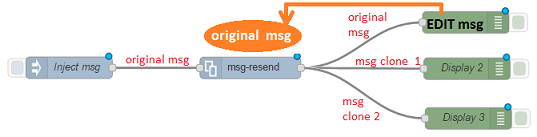
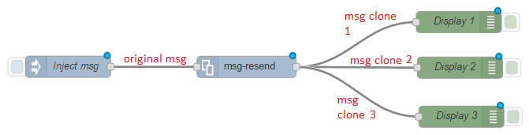

# node-red-contrib-msg-resend
A Node Red node for resending flow messages.

This node will resend the *last* input message several times to the output port, at specified time intervals.  The resending will continue until the maximum number has been reached, or until the next input message arrives.

When a new input message arrives, the active resending process (of the previous input message) will be stopped.  And the resending process will start for the new input message.  

Remark: An error will be generated, if input messages arrive too fast.

## Resend interval
The interval (in seconds) between two resends can be specified.  E.g. an interval of 5 seconds means, that the last input message will be resend every 5 seconds.

## Max. count
The maximum number of resends (of the *same* input message) can be specified.  E.g. a maximum of 10 means, that the last input message will be resend maximum 10 times.

Remark: A value of 0 means that the message will be resend infinitly.

## Force cloning (advanced)
By default, the Node-Red flow framework will clone messages automatically: When a node puts a message on it's output port, that *original* message will be send (without cloning) via the first wire to the next node.  When multiple wires are connected to that output port, the message will be *cloned* automatically by Node-Red when send to wire 2, wire 3 ... :

This works fine until the 'Display 1' node is replaced by any node that actually is going to *change* the message it receives: 

Indeed, the node-red-contrib-msg-resend node keeps a reference to the original message (to be able to resend it).  When that message is being changed by another node, the cloned messages (to 'Display 2' and 'Display 3') *will also contain those changes*!.

This issue can be solved easily by selecting the **force cloning** checkbox.  In that case node-red-contrib-msg-resend node will always clone the message itself, so the original message is never send on the wires (but only clones):

Remark: be aware that the messages are now cloned twice (except from the first wire): once by the node-red-contrib-msg-resend node, and once by the Node-Red flow framework.  This might reduce performance e.g. when the message contains large buffers.  In those cases, it might be advisable to turn off the 'force cloning'...
